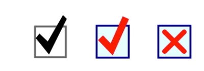

# RAHCheckbox

CheckBoxSwift  

### About
RAHCheckbox is a control class that provides a single instance of a checkbox. Properties can be set to change colors, border and checkmark widths, and the type of checkmark. Animation can be enabled.

Class Name: &nbsp;&nbsp; RAHCheckbox  
Subclass of: &nbsp;&nbsp; UIControl  
Platform: &nbsp;&nbsp;&nbsp;&nbsp;&nbsp;&nbsp;&nbsp;&nbsp; iOS 8 or later  
Language: &nbsp;&nbsp;&nbsp;&nbsp;&nbsp; Swift

There are versions written in Objective-C and in Swift.  
CheckBoxC is written in Objective-C  
CheckBoxSwift is written in Swift

### Features

Each instance of RAHCheckbox creates one checkbox. Each instance is similar in use to Apple's Switch control, and is a subclass of UIControl. A checkbox accepts a touch from the user and switches between on and off states. When on, it displays a checkmark or an X. When off, the checkmark box is empty.

The RAHCheckbox class is standalone. There are no dependancies with other classes other than Apple's UIKit. To use in your own project, just copy the RAHCheckbox class.

The following modifications can be made to the appearance of a checkbox using discrete methods:  

- size
- color of the checkbox border (if you do not want a checkbox, use a clear color for this attribute)
- color of the checkbox background
- width of the checkbox border
- color of the checkmark
- width of the stroke that draws the checkmark
- type of checkmark (a standard 'checkmark' or an X)

In addition, the checkmark can be animated; when the control is touched, the checkmark or X is drawn, rather than just appearing.

- turn animation on/off
- set the duration of the animation; when animated, the checkmark will fade in one-half the defined animation time.

When animated, the style of the checkmark is a more simple looking version of the un-animated checkmark.

Two methods set the state and get the state of the checkbox. There is one delegate protocol method that is typically used to notify the parent class that the value of the checkbox has changed.

### Use

In the example project, two instances of RAHCheckbox have been created in the ViewController. One instance was created in code, and the second using the Interface Builder. This project should compile in Xcode and run in the simulator as is; use it to play with the examples.

If using a version of Swift older than 4.2, the compile will fail. check comments at the point of failures for alternate constant names that should be used.

To use RAHCheckBox, copy the RAHCheckbox class to your project.

Create a checkbox in code in one of your view controllers, and be sure to add the checkbox to the your view controller's view:
>	checkbox1 = RAHCheckbox.init(frame: CGRect(x:52, y:100, width:100, height:25))  
>        //  this checkbox will be 100 x 100  
>	self.view.addSubview(checkbox1!)

To create a checkbox using the Interface Builder, create a small UIView object in the IB. Then, in the identity Inspector, change the class to 'RAHCheckbox'. Create an IBOutlet of type RAHCheckbox in the header of one of your view controllers, and link to it from the Interface Builder.

In both types of instances, the height dimension is ignored, and the checkbox is created as a square with height equal to width.

If you need to be notified that the checkbox has changed value, set the delegate:
>	checkbox1?.delegate = self;

You can then use available methods to set the appearance of the checkbox and checkmark, and the use of animation. Examples of these methods are shown in the ViewController of this project; these checkbox examples are much larger than you will likely use.

Look in the header of the RAHCheckbox to see comments describing the available settings.

The size of the checkbox is determined when initialized, although size can be modified in your parent viewController's "updateConstraints" method. The size of the checkbox itself is inset from each side by 15% of the total width. The checkbox is a square. If your defined rectangle for the control is not square, it is made a square by using the defined width for both width and height.

This image shows examples of the checkbox. The first image shows a standard checkbox and checkmark with default colors, etc. However, animation is set to NO. There are subtle shape differences between the non-animated mark (first image) and the animated mark (second image).

The second image shows custom colors, and the checkmark shape used for an animated checkmark. The third image shows the X option.

### Attribution

If you use this class, give attribution in your project or app's copyright notices. You must include "portions ©R.A.Hyman 2019. All rights reserved" along with each instance of your own copyright notice. You may not modify this code or use it as a pattern for your own class to avoid these attributions.

### Documentation

Documentation comprises this ReadMe and the notes found in the code. For further notes on setting up and using this class, look in the ViewController object for specific examples.

### Contributing

Please send any ideas, suggestions, bugs, questions to the author.

### Author

Richard Hyman  
I am a freelance iOS and Mac app developer.  

The code is ©2019 R.A.Hyman.  All rights reserved. Portions ©2011-2019

### License

RAHCheckbox is released under the MIT license. See LICENSE file for details.

